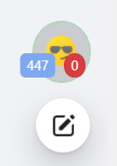
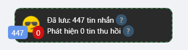
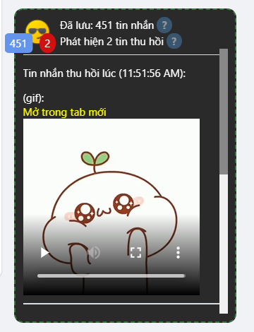

# Reveal Deleted FB Messages

Một extension nho nhỏ, giúp mọi người xem lại những tin nhắn đã bị đối phương xóa trong fb messenger.

- [Post hướng dẫn tạo Extension này](https://www.facebook.com/groups/j2team.community/posts/1650103925321721/)

- [Post giới thiệu v2](https://www.facebook.com/groups/j2team.community/posts/1651683238497123/)

*Ý tưởng và Tham khảo code từ [KB2A Tool](https://kb2atool.com/)*

## Cài đặt

Hiện tại chưa up lên store nên các bạn sẽ cần cài đặt thủ công

- B1: **Tải code** về (ấn nút clone - dowload zip)
- B2: **Giải nén** file zip vừa tải
- B3: Vào trang quản lý extension của trình duyệt bạn dùng, bật **developer mode** (để có thể cài extension từ các nguồn ngoài web store)
- B4: **Kéo thả folder** vừa giải nén vào
- XONG

## Sử dụng

- Khi vào trang facebook hoặc messenger thì **extension sẽ tự chạy**
- RVDFM sẽ **lắng nghe và lưu** mọi tin nhắn tới và tin nhắn đi, hoặc khi bạn xem tin nhắn của ai đó RVDFM cũng sẽ lưu cho bạn
- Khi có ai đó **thu hồi tin nhắn**, RVDFM sẽ kiểm tra xem tin nhắn đó đã được lưu hay chưa, nếu đã được lưu, RVDFM sẽ hiển thị **nội dung đã lưu** ra cho bạn.

- **LƯU Ý**: Hiện tại **chưa đồng bộ** tin nhắn giữa [facebook.com](https://facebook.com) và [messenger.com](https://messenger.com), nên RVDFM sẽ lưu tin nhắn trong 2 trang này 1 cách riêng biệt.

## Cập nhật

- 02/09/2021: Giao diện đẹp hơn, gọn gàng hơn, khung kéo thả tối giản hơn.
- 01/09/2021: [Bài viết](https://www.facebook.com/groups/j2team.community/posts/1651683238497123/) Version 2: Có giao diện ngay trong trang fb, hiển thị mọi loại tin nhắn, prevent XSS, ...
- 31/08/2021: extension đã có giao diện popup riêng. Các bạn ấn vào icon extension là sẽ thấy các tin nhắn bị gỡ.
- 30/08/2021: chức năng cơ bản hoàn thành. Hiển thị tin nhắn trong console.

## Screenshots

### v2 ngày 02/09/2021

- Normal

    - 

- Expanded

    - 

- Reveal 1

    - 

- Reveal 2
    
    - 
